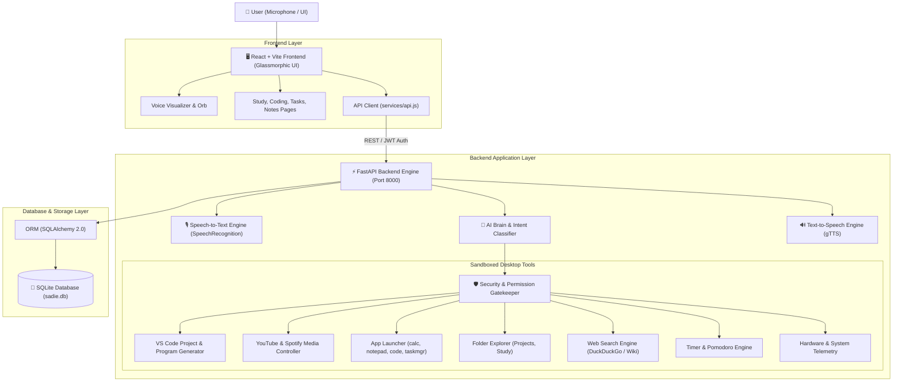
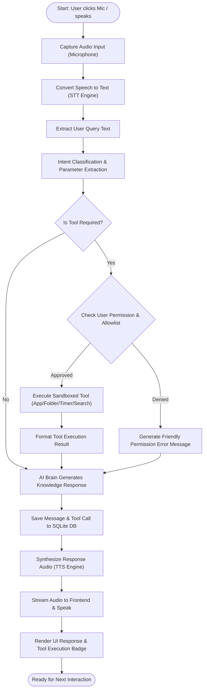
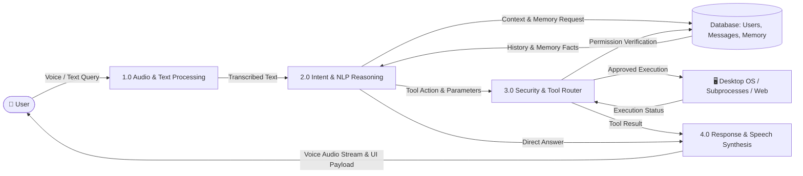
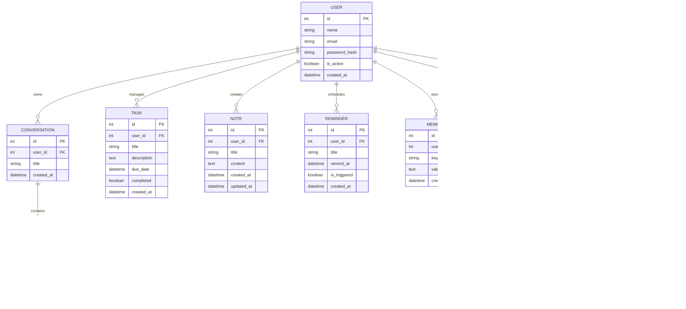

# SADIE — System Architecture & UML Diagrams

---

## 1. System Architecture Diagram

---

## 2. End-to-End Voice Interaction Flowchart

---

## 3. Data Flow Diagram (DFD Level 1)

---

## 4. Entity-Relationship (ER) Diagram

